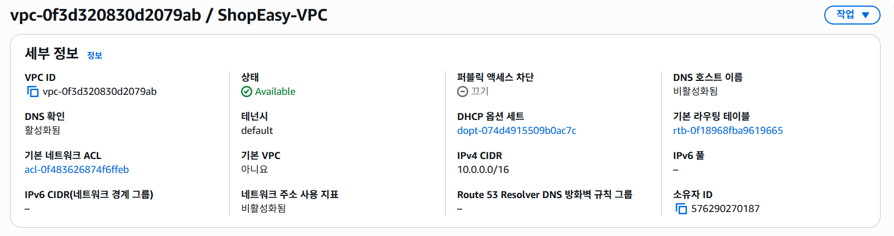
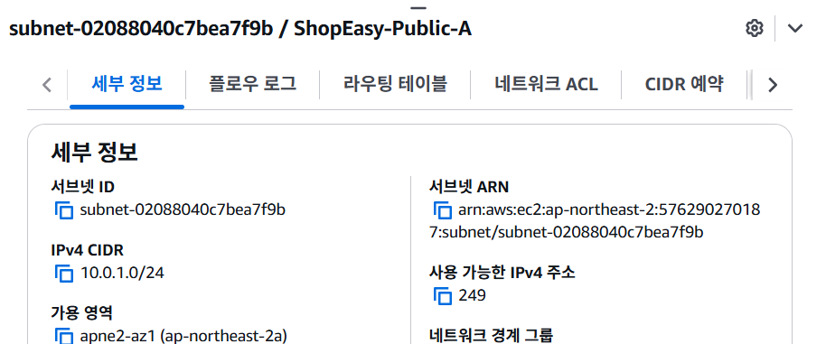
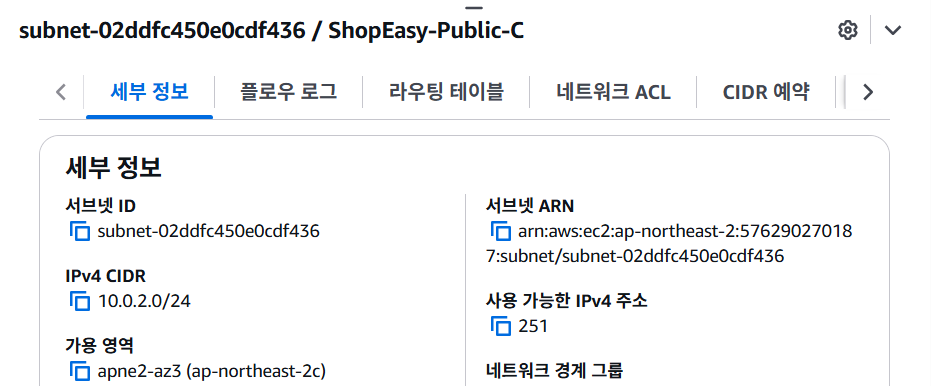
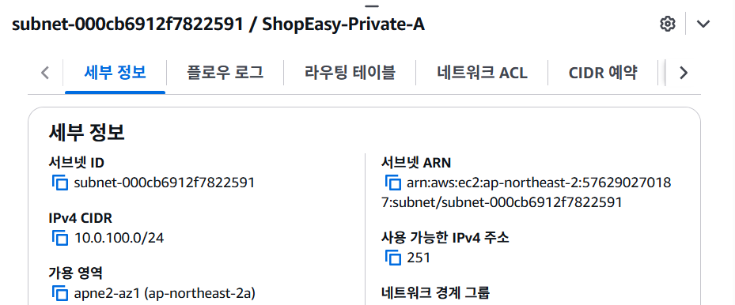
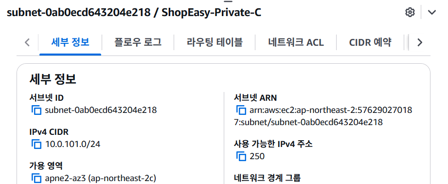
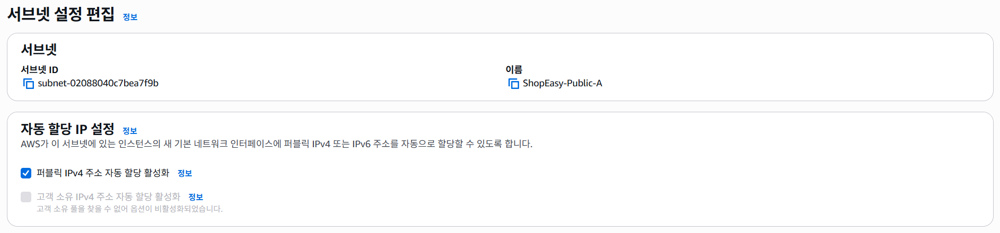
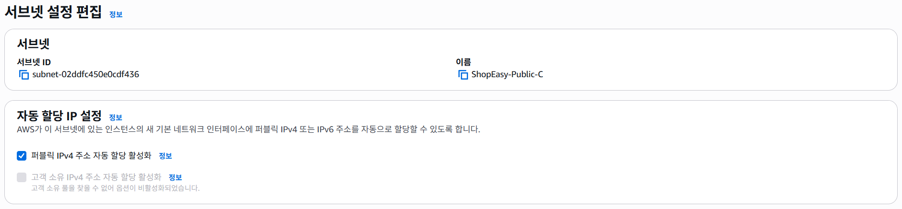
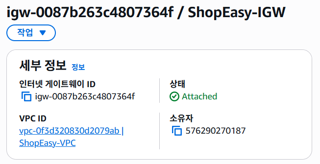
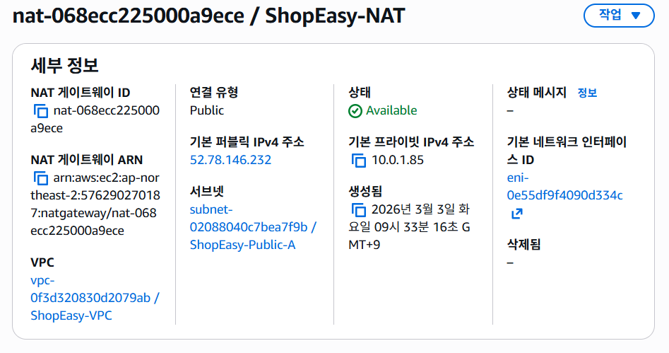

# Ch1. AWS 인프라 구축

## VPC가 왜 필요한가

AWS에 서버를 만들면 전 세계 수백만 명이 같은 AWS 인프라를 공유하고 있다.

만약 네트워크가 분리되어 있지 않다면  
다른 사용자가 내 데이터베이스에 접근할 가능성이 존재한다.

따라서 AWS에서는 **VPC (Virtual Private Cloud)** 를 통해

> AWS 내부에 **나만의 전용 네트워크를 만들어 다른 사용자와 완전히 격리된 환경을 제공**한다.

---

## 서브넷을 2개씩 만드는 이유 ⭐

`ap-northeast-2a` 와 `ap-northeast-2c` 두 개의 AZ에 서브넷을 배치한다.

이렇게 하면

- 하나의 데이터센터에 장애가 발생하더라도
- 다른 데이터센터에서 서비스가 계속 동작한다.

즉

**고가용성 (High Availability)** 을 확보할 수 있다.

---

## 퍼블릭 서브넷 vs 프라이빗 서브넷 차이

| 구분 | 퍼블릭 서브넷 | 프라이빗 서브넷 |
|-----|---------------|---------------|
| 인터넷에서 접근 | 가능 (IGW 경유) | 불가능 |
| 인터넷으로 나가기 | 가능 (IGW 경유) | 가능 (NAT GW 경유) |
| 배치 리소스 | EC2, NAT Gateway, ALB | RDS, ElastiCache |
| 라우트 테이블 | 0.0.0.0/0 → IGW | 0.0.0.0/0 → NAT GW |

### 중요한 보안 규칙

- **데이터베이스(RDS)** 는 반드시 **프라이빗 서브넷에 배치**

→ 인터넷에서 직접 DB 접근을 차단

이것이 **네트워크 보안의 첫 번째 방어선**

---

### NAT Gateway 역할

NAT Gateway는

> 프라이빗 서브넷의 트래픽을 받아 **인터넷으로 전달하는 역할**

하지만 NAT Gateway가 인터넷에 접근하려면

- 반드시 **퍼블릭 서브넷에 생성되어야 한다**

또한

프라이빗 리소스(RDS 등)는

- **인터넷으로 나가는 것만 허용**
- **외부에서 직접 접근은 불가능**

---

## Node.js 20 LTS 설치 이유

ShopEasy API 서버는 **Node.js 기반**으로 작성되어 있다.

따라서 서버 환경에서도 동일한 런타임을 사용하기 위해

**Node.js 20 LTS 버전을 설치한다.**

---

# VPC 생성 과정

## VPC 생성 항목

---

## 퍼블릭 / 프라이빗 서브넷 2개씩 생성 (Multi-AZ)

---

## 퍼블릭 서브넷 자동 IP 할당

퍼블릭 서브넷에 생성되는 EC2 인스턴스는  
자동으로 **Public IP** 를 할당받도록 설정한다.

---

## Internet Gateway 생성 및 VPC 연결

VPC에서 인터넷 접근을 허용하기 위해  
**Internet Gateway(IGW)** 를 생성하고 VPC에 연결한다.

---

## NAT Gateway 생성

프라이빗 서브넷에서 인터넷으로 나가기 위해  
**NAT Gateway** 를 생성한다.

NAT Gateway는 **반드시 퍼블릭 서브넷에 생성해야 한다.**

---

## 퍼블릭 라우트 테이블 설정

퍼블릭 서브넷의 라우트 테이블
